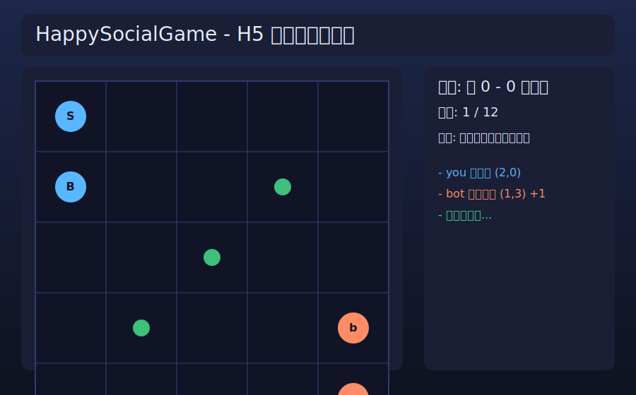

# HappySocialGame（社交对战游戏 MVP）

这是一个可运行的社交对战游戏 MVP，提供：

- **H5 网页可玩版本**（主入口，浏览器点击游玩）
- CLI 版本（命令行游玩/自动演示）
- 代码生成像素美术资产（PPM）
- 基础排位与社交模块

## H5 游玩体验（推荐）

### 启动本地静态服务器

```bash
python3 -m http.server 8000
```

然后打开：

- `http://localhost:8000/h5/`


### H5 界面预览（仓库内置，避免截图链接失效）



### H5 玩法

- 你 vs 机器人，5x5 棋盘回合制
- 点击你的单位，再点击目标格，按“确认行动并结束回合”
- 据点（绿色圆点）每回合占领得分
- 胜负条件：
  - 击败对方全部单位，或
  - 先到 6 分，或
  - 12 回合后比分高者获胜

## CLI 版本

### 1) 交互版

```bash
python3 main.py
```

### 2) 自动演示（bot vs bot）

```bash
python3 main.py --auto
```

## 代码生成美术资产

```bash
python3 tools/generate_assets.py
```

输出目录：`assets/generated`

- `unit_scout.ppm`
- `unit_bruiser.ppm`
- `control_point.ppm`

## 项目结构

- `h5/index.html` / `h5/style.css` / `h5/app.js`：H5 可玩前端
- `social_game/engine.py`：Python 回合规则引擎
- `social_game/ai.py`：Python AI 策略
- `social_game/render.py`：终端棋盘渲染
- `social_game/rating.py`：Elo + TrueSkillLite
- `social_game/social.py`：好友/公会/回放能力
- `tools/generate_assets.py`：代码生成像素美术
- `tests/test_engine.py`：Python 回归测试
# HappySocialGame MVP

一个面向**社交对战**的可迭代原型仓库，当前聚焦：

- 原型B：异步回合「棋盘突袭」
- 轻量匹配与排位（Elo + 可扩展到 Glicko/TrueSkill）
- 可快速验证的服务端权威回合结算逻辑

## 快速开始

```bash
python3 -m unittest discover -s tests -p 'test_*.py' -v
python3 src/demo.py
```

## 目录

- `docs/PRODUCT_PLAN.md`：玩法、社交、排位、赛季与变现方案
- `src/game.py`：异步回合棋盘核心规则
- `src/matchmaking.py`：异步对战匹配队列（支持宽松时延）
- `src/rating.py`：排位算法抽象与 Elo 实现
- `src/demo.py`：本地演示脚本
- `tests/`：核心规则与排位测试
